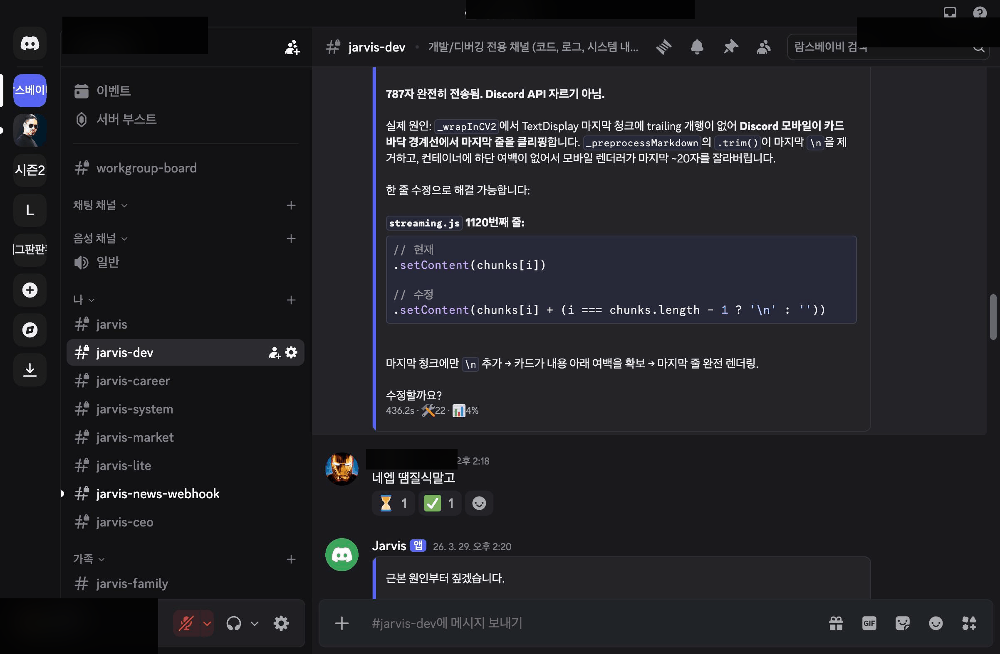
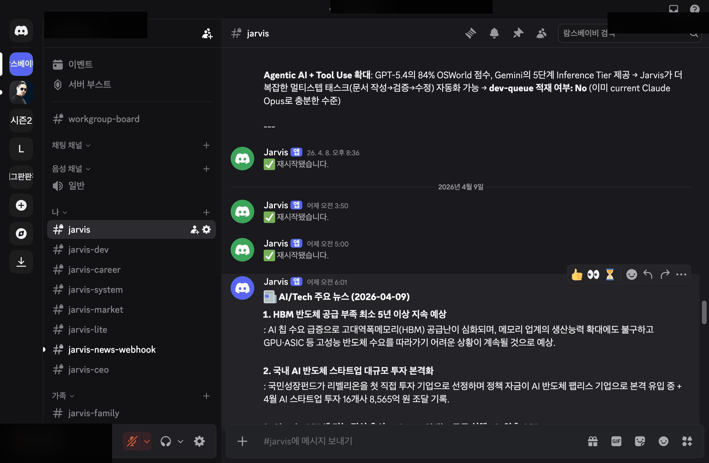

# Jarvis

<p align="center">
  <strong>24/7 스스로 관리되는 AI 운영 플랫폼</strong><br>
  Discord 봇 + RAG 지식 베이스 + 인사이트 레이어 + 자가 복구 자동화
</p>

<p align="center">
  
  
  
  
</p>

<p align="center">
  
</p>
<p align="center"><em>Discord 봇: 코드 리뷰 + 인라인 수정 제안</em></p>

<p align="center">
  
</p>
<p align="center"><em>자동화: 일일 AI/Tech 뉴스 브리핑</em></p>

---

## Jarvis가 뭔가요?

**AI 운영 플랫폼** — Claude 기반 Discord 봇, RAG 지식 베이스, 행동 분석 인사이트 엔진, 110+ 자동 관리 스크립트. 모든 것이 로컬에서 돌아갑니다.

```
                    ┌─────────────────┐
                    │    사용자 접점    │
                    └────────┬────────┘
                ┌────────────┼────────────┐
                ▼                         ▼
          💬 Discord                🔧 자동화
       텍스트 + 음성 24/7          크론 + 에이전트
                │                         │
                └────────────┬────────────┘
                             ▼
               ┌────────────────────────┐
               │     Jarvis Core        │
               │                        │
               │  📚 RAG (LanceDB)      │
               │  🧠 인사이트 레이어     │
               │  🔌 MCP (연동)         │
               │  🤖 8개 AI 에이전트 팀  │
               │  📋 Dev-Queue (자동)    │
               └────────────────────────┘
```

## 핵심 기능

| | 기능 | 설명 |
|---|------|------|
| 💬 | **Discord 봇** | 24/7 채팅. 스트리밍 응답, 음성 인식(Whisper STT), 채널별 페르소나, 16+ 슬래시 커맨드 |
| 👥 | **멀티유저** | 유저별 격리된 메모리, 페어링 코드로 신규 유저 등록, 가족 모드(프라이버시 경계) |
| 📚 | **RAG 지식 베이스** | 장기 기억. BM25 + 벡터 하이브리드 검색, 10,000+ 문서 |
| 🧠 | **인사이트 레이어** | 매일 자동 생성되는 행동 분석 리포트 — 활동 추세, 집중 전환, 상황 맥락 감지 |
| 📋 | **Dev-Queue** | AI가 추출한 작업 항목을 자동 큐잉 → `jarvis-coder.sh`가 자동 실행 — 손 안 대고 개발 |
| 🤖 | **8개 AI 팀** | Council, Infra, Record, Brand, Career, Academy, Trend, Recon — 전문 에이전트 |
| 🔧 | **자가 복구** | 워치독 자동 재시작, LaunchAgent 가디언(3분), 새벽 코드 감사, 크론 실패 추적 |
| 🔒 | **100% 로컬** | 클라우드 없음. 구독 없음. 모든 데이터가 내 컴퓨터에 |
| 🔌 | **MCP 연동** | Home Assistant, GitHub, Slack, Notion 등 [MCP 생태계](https://github.com/topics/mcp-server) |

## 빠른 시작

```bash
git clone https://github.com/Ramsbaby/jarvis.git && cd jarvis
```

### 1단계: RAG — 장기 기억

```bash
python scripts/setup_rag.py
```

> **필요**: [Ollama](https://ollama.com/download), Node.js 18+

### 2단계: Discord 봇 + 자동화

```bash
python scripts/setup_infra.py
```

> **필요**: Node.js 18+, Discord 봇 토큰

## Discord 봇

Claude 기반 24/7 인터페이스.

### 슬래시 커맨드

| 커맨드 | 설명 |
|--------|------|
| `/search <쿼리>` | RAG 하이브리드 검색 |
| `/remember <내용>` | 장기 기억에 저장 (자동 분류: 투자/업무/가족/여행/건강) |
| `/memory` | 저장된 사실, 선호도, 수정사항 조회 |
| `/team <이름>` | AI 팀 소환 (Council/Infra/Career/Academy/Trend/Recon...) |
| `/run <작업>` | 크론 작업 수동 실행 (자동완성) |
| `/schedule <작업> <후>` | 30분/1시간/2시간/4시간/8시간 후 실행 예약 |
| `/status` | 시스템 상태 대시보드 (디스크/메모리/크론) |
| `/doctor` | 전체 점검 + 자동 수정 (오너 전용) |
| `/approve [초안]` | 문서 초안 승인 → 자동 적용 |
| `/commitments` | 자비스가 감지한 미이행 약속 목록 |
| `/usage` | API 비용 & 사용량 대시보드 |
| `/alert <메시지>` | Discord + 푸시 알림 (ntfy.sh) |
| `/lounge` | 실행 중인 작업 라이브 피드 |

### 음성 인식

Discord 음성 메시지를 **OpenAI Whisper** (한국어 + 다국어)로 자동 변환. 변환된 텍스트는 RAG 컨텍스트와 함께 Claude가 처리합니다. 자연스럽게 말하면 AI가 응답합니다.

### 인터랙티브 버튼

모든 응답에 상황별 액션 버튼:
- **Cancel** — 진행 중인 작업 중단
- **Regen** — 마지막 쿼리 재실행
- **Summarize** — 응답 요약
- **Approve / Reject** — L3 자율 작업 승인 워크플로우

### 멀티유저 & 가족 모드

- 각 Discord 유저는 **격리된 메모리** (사실, 선호도, 수정사항, 계획)
- 신규 유저는 **페어링 코드**로 등록 (6자리, 10분 TTL, 오너 승인)
- **가족 채널**에서는 오너의 개인 데이터(투자, 커리어) 자동 필터링
- 채널별 **페르소나** — 채널마다 다른 성격 (`personas.json`)

## RAG 지식 베이스 + 인사이트 레이어

두 레이어가 함께 동작 — RAG가 사실을 검색하고, 인사이트 레이어가 맥락을 이해합니다.

```
📊 인사이트 레이어 (매일, ~1.2KB)                📚 RAG 레이어 (쿼리별)
  "커리어 토픽 534배 급증"                          10,000+ 문서에서
  "인프라에서 면접 준비로 집중 전환"                  시맨틱 검색
              │                                              │
              └──────────────┬───────────────────────────────┘
                             ▼
                    Claude가 현재 상황을 파악한 채 응답
```

### 인사이트 레이어

매일 04:15 자동 생성되는 행동 분석:

| 단계 | 스크립트 | LLM | 비용 |
|------|---------|:---:|:----:|
| 메트릭 수집 | `insight-metrics.mjs` | 불필요 | $0 |
| 해석 | `insight-distill.mjs` | Claude | ~$0.03 |

감지 항목: 토픽 빈도 변화, 도메인 간 상관관계, 엔티티 모멘텀, 일별 활동 패턴. Google Calendar 연동으로 D-day 인식.

### RAG

BM25 + Ollama 벡터 하이브리드 검색 (`snowflake-arctic-embed2`, 1024-dim).

| 사양 | 값 |
|------|------|
| **벡터 DB** | LanceDB (로컬, 임베디드) |
| **인덱싱** | 증분 4시간, 엔티티 그래프 매일 |
| **검색** | BM25 + 벡터 하이브리드 (RRF k=60) + GraphRAG 확장 |
| **스마트 필터** | 개발 문서 자동 제외, 가족 채널 민감 데이터 필터링 |

자세한 내용: [`rag/README.md`](rag/README.md)

## Dev-Queue — 자율 개발

자비스는 채팅만 하지 않습니다 — **코드도 짭니다**.

1. **인사이트 추출기**가 작업 결과와 뉴스를 분석, 우선순위 높은 액션 아이템을 자동 추출
2. **SQLite 태스크 스토어**에 FSM 상태 추적으로 큐잉 (PENDING → RUNNING → SUCCESS/FAILED)
3. **`jarvis-coder.sh`**가 대기 중인 작업을 Claude로 실행 — 자동 커밋, 수정, 개선
4. 재귀 자기 수정 방지 패턴 (수동 작업, 자기 참조 항목 필터링)

## 자가 복구 자동화

<p align="center">
  
</p>
<p align="center"><em>자동 시스템 점검: 10개 서비스를 6시간마다 모니터링</em></p>

Jarvis는 실행만 하지 않습니다 — **스스로 복구합니다.** 110+ 스크립트, 11개 LaunchAgent, 40+ 크론:

| | 하는 일 | 주기 |
|---|---|---|
| 🔄 | **자동 복구** — 워치독이 죽은 서비스 감지, 재시작. Guardian이 3분마다 언로드된 데몬 재등록 | 24/7 |
| 🔍 | **새벽 감사** — 크론 상태, RAG 무결성, 봇 상태 스캔. `jarvis-auditor.sh` + `scorecard-enforcer.sh`로 이상 보고 | 매일 06:00 |
| 📊 | **인사이트 리포트** — 행동 메트릭 분석 → 모든 응답에 상황 인식 컨텍스트 주입 | 매일 04:15 |
| 🧪 | **E2E 테스트** — `e2e-test.sh`로 50개 시스템 컴포넌트 검증. `weekly-code-review.sh`로 코드 품질 감사 | 주간 |
| 📚 | **RAG 파이프라인** — 증분 인덱싱(4h), 엔티티 그래프(03:45), 주간 압축(일 04:00), 파일 워처로 실시간 감지 | 스케줄 |
| 📡 | **헬스 모니터** — 10개 서비스, 디스크/메모리 알림. Discord + ntfy.sh 푸시 | 6시간마다 |
| 📈 | **크론 실패 추적** — 성공률 추적, 성능 저하 추세 감지 | 상시 |
| 🚀 | **안전 배포** — 스모크 테스트, 무중단 재시작, 로그 로테이션 | 수동 |
| 📰 | **뉴스 브리핑** — AI/Tech 뉴스 큐레이션 + dev-queue 제안 | 매일 |

### 8개 AI 에이전트 팀

`/team <이름>`으로 전문 팀 소환:

| 팀 | 역할 |
|----|------|
| **Council** | CEO급 시스템 리뷰 — 안정성 + 시장 + OKR 의사결정 |
| **Infra** | 인프라 책임자 — 크론/LaunchAgent/디스크/메모리 감사 |
| **Record** | 회의록 + 의사결정 감사 로그 |
| **Brand** | 블로그 콘텐츠 + 포트폴리오 관리 |
| **Career** | 이직 전략 + 면접 준비 |
| **Academy** | 학습 계획 + 스킬 개발 |
| **Trend** | 시장 시그널 + 기술 트렌드 분석 |
| **Recon** | 정찰 — 경쟁사 인텔리전스 |

### 스마트 기능

| 기능 | 설명 |
|------|------|
| **약속 추적** | Claude 응답에서 약속 자동 감지, 이행 추적 |
| **L3 승인 워크플로우** | 자율 작업이 Discord 버튼으로 인간 승인 요청 (24시간 TTL) |
| **메시지 디바운싱** | 연속 메시지를 묶어서(1.5초) 단일 Claude 호출로 처리 |
| **컨텍스트 버짓** | 프롬프트 복잡도 자동 분류, 사고 깊이 조절 |
| **비주얼 생성** | 차트(ChartJS) + 테이블(Puppeteer) → 이미지 렌더링, SHA256 캐시 |
| **통계 카드** | "디스크?", "RAG 상태?" → 비주얼 임베드 카드 자동 생성 |
| **레이트 리미팅** | 유저별 토큰 버짓 + 세마포어 동시 제어 (최대 3) |
| **다국어** | 한국어 + 다국어 지원 |

## 프로젝트 구조

```
jarvis/
├── rag/                 # RAG 모듈 (LanceDB + Ollama + 인사이트 레이어)
│   ├── lib/             # 코어 엔진, 쿼리, 경로
│   └── bin/             # 인덱서, 메트릭, 디스틸러, 수리
├── infra/               # 인프라 & 자동화
│   ├── discord/         # Discord 봇 + 30개 핸들러
│   ├── lib/             # 핵심 라이브러리 (MCP, task-store, insight-extractor)
│   ├── bin/             # 크론 실행 (jarvis-cron, jarvis-coder, bot-cron)
│   ├── scripts/         # 감사, E2E 테스트, 코드 리뷰, 배포
│   ├── config/          # 작업, 페르소나, 채널, 모니터링
│   ├── agents/          # 8개 AI 팀 프로필
│   └── templates/       # 크론 & LaunchAgent 템플릿
├── scripts/             # 셋업 위자드
└── docs/img/            # 스크린샷
```

<details>
<summary><strong>보안</strong></summary>

- **gitleaks** 프리커밋 훅으로 매 커밋 전 시크릿 스캔
- **`private/`** 디렉토리 git 제외 (민감 데이터)
- 가족 채널 프라이버시 경계 (오너 데이터 필터링)
- TTL 페어링 코드로 신규 유저 온보딩

</details>

<details>
<summary><strong>트러블슈팅</strong></summary>

- **Discord 봇 안 뜸** — `.env`에 `DISCORD_TOKEN` 확인
- **RAG 결과 없음** — `cd rag && npm run stats`로 DB 상태 확인
- **크론 안 돌아감** — `crontab -l` 확인, 로그: `~/.local/share/jarvis/logs/`
- **인사이트 리포트 없음** — `BOT_HOME=~/.jarvis node rag/bin/insight-distill.mjs`

</details>

## 라이선스

[MIT](LICENSE)

---

<p align="center">
  <a href="README.md">🇺🇸 English</a>
</p>
