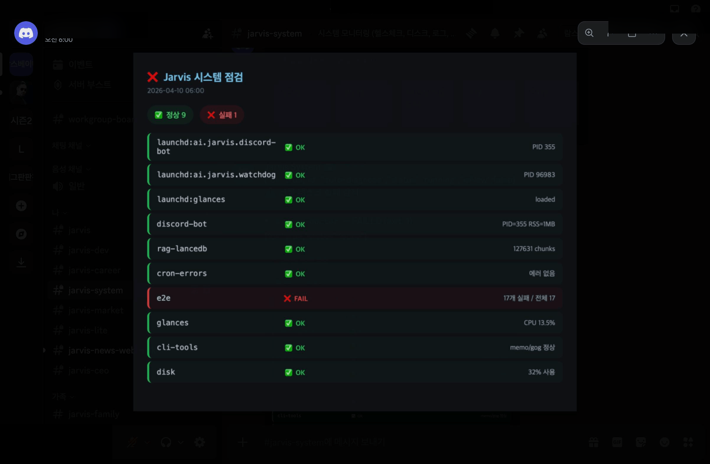

# Jarvis

> **⚠️ Migration Notice (2026-04-17)**: Runtime data relocated from `~/.jarvis/` → `~/jarvis/runtime/`.
> Existing installations: `~/.jarvis` remains as a backward-compatible symlink through **2026-10-17** (D+180).
> Fresh installs: use `~/jarvis/runtime/` directly. See [docs/A2-MIGRATION.md](infra/docs/A2-MIGRATION.md) (upcoming).

<p align="center">
  <strong>AI operations platform that manages itself 24/7</strong><br>
  Discord Bot + RAG Knowledge Base + Insight Layer + Self-Healing Automation
</p>

<p align="center">
  
  
  
  
  
</p>

<p align="center">
  
</p>
<p align="center"><em>Ask Jarvis anything — it analyses your behaviour patterns + daily auto-generated insight report</em></p>

<p align="center">
  
</p>
<p align="center"><em>Dawn system health check (10 services) + L3 autonomous task approval workflow</em></p>

---

## What is Jarvis?

> **"An AI assistant that audits your systems, analyses news, and writes code — while you sleep."**

Message it on Discord and it chats. Send a voice message and it understands. Drop a file and it remembers.
Overnight, 99 automation scripts run cron jobs. If a service dies, it self-recovers within 3 minutes.
Every dawn, it analyses your behavioural patterns and responds knowing what you're focused on right now.
Zero API charges — runs on a Claude subscription. 100% of your data stays on your machine.

**In short**: A personal AI operations platform. Runs 24/7, fixes itself when it breaks, gets smarter as you use it.

### Architecture

| Layer | Components | Role |
|:---:|------|------|
| **Interface** | Discord (text + voice) | 24/7 conversational UI. 16+ slash commands, buttons, voice recognition |
| **Brain** | Claude + 8 AI agent teams | Chat, analysis, code generation, decision-making |
| **Harness** | Prompt Harness + Progressive Compaction + Session Handoff | Tiered prompt loading (77% token savings), 3-stage context management (40K/60K/80K), structured state transfer between sessions |
| **Memory** | RAG (LanceDB) + **LLM Wiki** + Insight Layer + **Importance Gate** | 10,000+ doc search + Stateful wiki + behavioural metrics + Mem0-style scoring (score ≥ 3 only stored) |
| **Defense** | BoundedMap + Error Ledger + API Semaphore + Failure Rule Engine | Memory leak prevention, silent error tracking, concurrent API protection, auto pattern matching for known failures |
| **Automation** | 99 scripts + 40+ crons (LaunchAgents on macOS, PM2 on Linux) | Self-healing, dawn audits, news briefing, auto code execution |
| **Integration** | MCP + Google Calendar + GitHub | External service connectivity |

## Core Features

| | Feature | Description |
|---|---------|-------------|
| 💬 | **Discord Bot** | 24/7 chat with streaming, voice recognition (Whisper STT), per-channel personas, 16+ slash commands |
| 👥 | **Multi-User** | Per-user isolated memory, pairing codes for new users, family mode with privacy boundaries |
| 📚 | **RAG Knowledge Base** | Long-term memory. BM25 + vector hybrid search across 10,000+ documents |
| 🗂️ | **LLM Wiki** | [Karpathy's 3-layer pattern](https://gist.github.com/karpathy/442a6bf555914893e9891c11519de94f) (Raw/Wiki/Schema). 4 ingest paths: realtime keyword routing, background LLM digest (Haiku), nightly batch synthesis (03:30), weekly lint (Sunday 04:00). Domain wikis (`career`/`trading`/`ops`/`knowledge`) + per-user pages. Feeds Discord bot, Board API, and Map NPCs. Knowledge compounds — new info updates existing pages, not appends |
| 🧠 | **Insight Layer** | Daily auto-generated behavioural report — detects activity trends, focus shifts, situational context |
| 📋 | **Dev-Queue** | AI-extracted action items auto-queued, then auto-executed by `jarvis-coder.sh` — hands-free development |
| 🤖 | **8 AI Teams** | Council, Infra, Record, Brand, Career, Academy, Trend, Recon — each with specialised agents |
| 🔧 | **Self-Healing** | Watchdog auto-restart, LaunchAgent guardian (3min), dawn code audits, cron failure tracking |
| 🏗️ | **Prompt Harness** | [Anthropic harness engineering](https://www.anthropic.com/engineering/effective-harnesses-for-long-running-agents) — Tier 0 (core, always <3KB) / Tier 1 (contextual, keyword-triggered). Progressive Compaction at 40K/60K/80K tokens. 77% system prompt reduction |
| 🛡️ | **Defense Layers** | BoundedMap (memory leak prevention), Error Ledger (JSONL audit trail), API Semaphore (concurrent call protection), Failure Rule Engine (auto pattern learning), Symlink Health Check (hourly validation) |
| 📢 | **Notification Formatter** | Cron messages get auto-headers (`> 🟢/🟡/🔴 taskname · HH:MM KST`), noise gate (suppress pure-success), severity-based Discord Embeds (Uptime Kuma pattern) |
| 🔒 | **100% Local** | No cloud. No subscriptions. All data stays on your machine |
| 🔌 | **MCP Integration** | Home Assistant, GitHub, Slack, Notion via [MCP ecosystem](https://github.com/topics/mcp-server) |

## How Jarvis Compares

|  | **Jarvis** | **Claude Memory** | **ChatGPT Memory** | **[OpenClaw](https://docs.openclaw.ai) Dreaming** |
|---|:---:|:---:|:---:|:---:|
| **Memory** | RAG + **LLM Wiki** + Insight Layer | File-based (CLAUDE.md + Auto Dream) | Inject-all (every memory, every turn) | 3-phase sleep cycle (Light → REM → Deep) |
| **Trend Detection** | Yes (topic freq shifts, entity momentum) | No | No | Yes (REM-phase pattern extraction) |
| **Automation** | 99 scripts + self-healing | No (CLI tool) | No | 1 cron (dreaming sweep) |
| **Autonomous Coding** | Yes (Dev-Queue → jarvis-coder) | No | No | No |
| **Multi-User** | Yes (isolated memory + family mode) | No (single user) | No (single user) | No (single agent) |
| **Cost** | $0 (Claude subscription) | $0 (subscription) | $0 (free tier) | $0 (open source) |
| **Data Location** | 100% local | Local (CLI) / Cloud (web) | Cloud (OpenAI servers) | Local |
| **Interface** | Discord (text + voice) | Terminal / Web | Web / App | Terminal / Web |

**What sets Jarvis apart**: It doesn't just remember — it **acts**. Memory + analysis + automation + self-healing in one system. Others stop at the memory layer; Jarvis uses memory to write code, recover services, and generate reports.

## Platform Support

| Platform | Status | Service Manager |
|----------|:------:|-----------------|
| **macOS** (primary) | Fully supported | LaunchAgents + cron |
| **Linux / WSL2** | Fully supported | PM2 + cron |
| **Docker** | Fully supported | PM2 (via `ecosystem.config.cjs`) |
| **Windows (native)** | Not supported | Use WSL2 or Docker |

> Cross-platform abstraction: `lib/compat.sh` auto-detects the OS and routes service commands (`launchctl` on macOS, `pm2` on Linux/WSL2).

## Quick Start

### Which plan do I need?

| Setup | What you get | AI requirement | Cost |
|-------|-------------|----------------|------|
| **Standard** | Discord bot + 80 cron automations | Claude Max **or** Pro subscription | $20/mo (Pro) or $100/mo (Max) |
| **Full** | Standard + RAG long-term memory | Claude subscription + Ollama (free, local) | same + 0 |

> **Claude Max** = unlimited usage, best for 24/7 bot. **Claude Pro** = works fine, may hit rate limits under heavy use.
> **Ollama** = free, open-source AI that runs locally. Only needed for RAG (document search + memory). The Discord bot itself runs on Claude.

---

### Step 0: Prerequisites

1. **Claude Code CLI** (the brain)
   ```bash
   npm install -g @anthropic-ai/claude-code
   claude   # opens browser to authenticate — log in with your Anthropic account
   ```
2. **Node.js 22+** and **Python 3.10+**
   ```bash
   node -v   # should be 22+
   python3 --version
   ```

### Step 1: Get a Discord Bot Token

> If you already have a token, skip to Step 2.

1. Go to [Discord Developer Portal](https://discord.com/developers/applications)
2. Click **"New Application"** → name it (e.g., "Jarvis") → **Create**
3. Left sidebar → **"Bot"** tab → click **"Reset Token"** → **Copy the token** (save it!)
4. Scroll down → enable **"Message Content Intent"** toggle → Save
5. Left sidebar → **"OAuth2"** → **"URL Generator"**:
   - Scopes: `bot`, `applications.commands`
   - Bot permissions: `Send Messages`, `Read Message History`, `Attach Files`, `Use Slash Commands`
6. Copy the generated URL → open in browser → invite the bot to your Discord server

### Step 2: Clone & Setup

```bash
git clone https://github.com/Ramsbaby/jarvis.git && cd jarvis
```

#### ⚡ Option A — Interactive Onboarding (Recommended)

Open the project in **Claude Code** and run:

```
/onboarding
```

The onboarding wizard guides you through Steps 0–14 (idempotent — re-runnable safely):

| Step | What it does |
|------|-------------|
| 0 | Checks Node.js 18+, git, Ollama (optional — RAG only) |
| 1 | Detects installation state → **[V]** verify only / **[U]** update specific values / **[R]** full reinstall |
| 2–5 | Collects tokens interactively — skips steps whose values are already configured |
| 6 | Creates/updates `~/.jarvis/.env` + 8 data directories — preserves existing values with `--merge` |
| 7 | Runs `npm install` + copies `*.example.json` config templates (skips existing files) |
| 8 | **RAG setup** (optional) — if Ollama detected, runs `python3 scripts/setup_rag.py` (~400MB model) |
| 9 | Asks: **Auto-update** or **Manual-update**? (skips if policy already set) |
| 10 | Creates `🚀jarvis-update` Discord channel + registers system persona |
| 11 | Installs LaunchAgents (macOS) or PM2 + cron (Linux) — skips already-running agents |
| 12 | Runs full verification: node_modules · bot syntax · data dirs · `.env` keys |
| 13 | Confirms bot startup via log output |
| 14 | Prints completion summary |

**Auto-update**: When a new release is detected at 03:00 KST, Jarvis pulls latest code, syncs files, restarts the bot, and posts a notice to `#🚀jarvis-update`. Uses semver comparison (upstream > installed only).

**Manual-update**: Posts a release alert to `#🚀jarvis-update` and waits for you to update.

---

#### Option B — Python Wizard

```bash
python scripts/setup_infra.py    # paste your Discord token when prompted
```

The setup wizard will:
- Check Node.js, create data directories
- Ask for your **Discord bot token** (from Step 1)
- Install dependencies and configure the bot

> **Detailed guide**: [`infra/CLAUDE-SETUP-GUIDE.md`](infra/CLAUDE-SETUP-GUIDE.md) — MCP servers, personas, context setup, and troubleshooting

### Step 3: RAG — Long-Term Memory (Optional, recommended)

This gives Jarvis the ability to search past conversations and documents.

```bash
# Install Ollama first (free, local AI for embeddings)
# macOS:
brew install ollama && ollama serve

# Linux:
curl -fsSL https://ollama.com/install.sh | sh && ollama serve

# Then run RAG setup:
python scripts/setup_rag.py    # downloads ~400MB embedding model, takes 2-5 min
```

### Platform-specific start

**macOS** — auto-starts via LaunchAgent (setup_infra.py configures this)

**WSL2 / Linux** — use PM2:
```bash
npm install -g pm2
pm2 start infra/ecosystem.config.cjs
pm2 startup && pm2 save   # auto-start on boot
```

## Discord Bot

A 24/7 interface powered by Claude with streaming responses.

### Slash Commands

| Command | Description |
|---------|-------------|
| `/search <query>` | RAG hybrid search across knowledge base |
| `/remember <content>` | Save to long-term memory (auto-categorised: trading/work/family/travel/health) |
| `/memory` | View your stored facts, preferences, corrections |
| `/team <name>` | Summon an AI team (Council/Infra/Career/Academy/Trend/Recon...) |
| `/run <task>` | Manually trigger a cron task (with autocomplete) |
| `/schedule <task> <in>` | Schedule a task 30m/1h/2h/4h/8h from now |
| `/status` | System health dashboard (disk/memory/cron) |
| `/doctor` | Full health check + auto-fix (owner only) |
| `/approve [draft]` | Approve a draft document → auto-apply |
| `/commitments` | View unfulfilled promises Jarvis detected |
| `/usage` | API cost & usage dashboard |
| `/alert <msg>` | Send Discord + push notification (ntfy.sh) |
| `/lounge` | Live activity feed of running tasks |
| `/clear` | Reset channel conversation |
| `/stop` | Cancel running Claude task |

### Voice Recognition

Discord voice messages are automatically transcribed via **OpenAI Whisper** (Korean + multilingual). The transcribed text is processed by Claude with full RAG context — speak naturally, get AI-powered responses.

### File Upload → Auto-Indexing

Drop a file in Discord and it's automatically indexed into RAG. Your knowledge base grows as you chat.

### Auto Memory Extraction with Importance Gate

Jarvis detects important information in conversations and auto-extracts it to long-term memory — preferences, facts, corrections. No manual `/remember` needed.

Each extracted fact is scored 1-5 by the LLM ([Mem0 pattern](https://arxiv.org/abs/2504.19413)). **Only score ≥ 3 is stored** — reduces memory bloat by 40-60%. Say "잊어줘" (forget this) to delete specific facts.

### Interactive Buttons

Every response includes contextual action buttons:
- **Cancel** — stop in-progress Claude tasks
- **Regen** — re-run the last query
- **Summarize** — get a summary of the response
- **Approve / Reject** — for L3 autonomous task approval workflow

### Multi-User & Family Mode

- Each Discord user gets **isolated memory** (facts, preferences, corrections, plans)
- New users join via **pairing code** (6-digit, 10min TTL, owner approval)
- **Family channels** automatically filter out owner's private data (configurable sensitive domains)
- Per-channel **personas** — different personality per channel (`personas.json`)
- **Message debouncing** — consecutive messages batched (1.5s) into single Claude call

## Memory Architecture

Three layers work together — LLM Wiki accumulates structured knowledge, RAG retrieves raw context, the Insight Layer understands behavioural patterns.

```
🗂️  LLM Wiki (daily digest)          📚 RAG Layer (per-query)          📊 Insight Layer (daily)
  profile.md / work.md /               semantic search across              "topic frequency shift detected"
  trading.md / projects.md             10,000+ indexed documents           "domain focus transition"
  (Stateful — pages updated,                    │                                    │
   not just appended)                           │                                    │
              │                                 │                                    │
              └─────────────────┬───────────────┘────────────────────────────────────┘
                                ▼
                       Claude responds with
                       full situational awareness
```

### LLM Wiki

Inspired by [Andrej Karpathy's LLM Wiki](https://gist.github.com/karpathy/442a6bf555914893e9891c11519de94f). Transforms raw conversation sessions into a **Stateful, compounding knowledge base**.

| | Traditional RAG | LLM Wiki |
|---|---|---|
| **Storage** | Raw text chunks | Structured `.md` wiki pages |
| **State** | Stateless (re-search each query) | Stateful (pages updated, not appended) |
| **Processing** | Index → retrieve | Claude Haiku digests → integrates into existing pages |
| **Growth** | Accumulates independently | Compounds — new info updates existing knowledge |

**7 wiki categories** (`~/.jarvis/wiki/pages/{userId}/`):

| Page | Captures |
|------|---------|
| `profile.md` | Name, job, family basics |
| `work.md` | Tech stack, work context, professional goals |
| `trading.md` | Portfolio, investment strategy, watchlist |
| `projects.md` | Ongoing projects (Jarvis bot, side projects) |
| `preferences.md` | Habits, likes/dislikes, routines |
| `health.md` | Exercise, health, sleep patterns |
| `travel.md` | Trip records and plans |

**How it works**: Every night (03:00) the session summariser digests today's conversations via Claude Haiku → new facts are routed to the correct wiki page → pages are updated (not just appended) → context is injected into the next session's system prompt.

### RAG Knowledge Base + Insight Layer

Two additional layers work together — RAG retrieves raw facts, the Insight Layer understands context.

```
📊 Insight Layer (daily, ~1.2KB)                 📚 RAG Layer (per-query)
  "topic frequency shift detected"                  semantic search across
  "domain focus transition"                         10,000+ indexed documents
              │                                              │
              └──────────────┬───────────────────────────────┘
                             ▼
                    Claude responds with
                    full situational awareness
```

### Insight Layer

Automated behavioural analysis, generated daily at 04:15:

| Step | Script | LLM | Cost |
|------|--------|:---:|:----:|
| Metrics collection | `insight-metrics.mjs` | None | $0 |
| Interpretation | `insight-distill.mjs` | Claude | ~$0.03 |

Detects: topic frequency shifts, cross-domain correlations, entity momentum, daily activity patterns. Integrates Google Calendar for D-day awareness. Output loaded into every system prompt automatically.

### RAG

Hybrid search: BM25 full-text + Ollama vector similarity (`snowflake-arctic-embed2`, 1024-dim).

| Spec | Value |
|------|-------|
| **Vector DB** | LanceDB (local, embedded) |
| **Embedding** | Ollama snowflake-arctic-embed2 |
| **Indexing** | Incremental every 4h, entity-graph daily |
| **Search** | BM25 + vector hybrid (RRF k=60) + GraphRAG expansion |
| **Smart filters** | Auto-excludes dev docs, filters family-sensitive data |

See [`rag/README.md`](rag/README.md) for details.

## Dev-Queue — Autonomous Development

Jarvis doesn't just chat — it **writes code**.

1. **Insight Extractor** analyses task results and news, auto-extracts high-priority action items
2. Items are queued in **SQLite task store** with FSM state tracking (PENDING → RUNNING → SUCCESS/FAILED)
3. **`jarvis-coder.sh`** picks up queued tasks and executes them via Claude — automated commits, fixes, improvements
4. Skip patterns prevent recursive self-modification (manual tasks and self-referential items are filtered)

## Self-Healing Automation

<p align="center">
  
</p>
<p align="center"><em>Automated system health check: 10 services monitored every 6 hours</em></p>

Jarvis doesn't just run — it **heals itself**. 99 automation scripts, 11 LaunchAgents, 40+ cron jobs. Multi-layer self-recovery + systemic defense:

**Harness (Anthropic 4-function pattern)**:
- **Guides**: Tiered prompt loading — Tier 0 (always, <3KB) / Tier 1 (keyword-triggered)
- **Sensors**: Session Handoff (structured state transfer) + Progressive Compaction (40K/60K/80K)
- **Verification**: Tool Call Ledger (per-invocation JSONL audit) + Error Ledger (silent error tracking)
- **Correction**: Failure Rule Engine (auto pattern learning + Bayesian confidence scoring)

| | What it does | When |
|---|---|---|
| 🔄 | **Auto-Recovery** — watchdog detects crashed services, restarts them. Guardian re-registers unloaded daemons every 3 min | 24/7 |
| 🔍 | **Dawn Audit** — scans cron health, RAG integrity, bot status. `jarvis-auditor.sh` + `scorecard-enforcer.sh` reports anomalies before you wake up | Daily 06:00 |
| 📊 | **Insight Report** — behavioural metrics analysis → situational awareness context for every response | Daily 04:15 |
| 🧪 | **E2E Testing** — `e2e-test.sh` validates 50 system components. `weekly-code-review.sh` runs automated code quality audits | Weekly |
| 📚 | **RAG Pipeline** — incremental indexing (4h), entity-graph (03:45), weekly compaction (Sun 04:00), file watcher for real-time updates | Scheduled |
| 📡 | **Health Monitor** — 10 services monitored, disk/memory alerts. Discord + ntfy.sh push notifications on threshold breach | Every 6h |
| 📈 | **Cron Failure Tracker** — `cron-failure-tracker.sh` tracks success rates, detects degradation trends | Continuous |
| 🚀 | **Safe Deployment** — smoke tests, graceful restart, log rotation. Zero-downtime updates | On demand |
| 📰 | **News Briefing** — AI/Tech news curation with dev-queue suggestions | Daily |

### 8 AI Agent Teams

Summon specialised teams via `/team <name>`:

| Team | Role |
|------|------|
| **Council** | CEO-level system review — stability + market + OKR decisions |
| **Infra** | Infrastructure chief — cron/LaunchAgent/disk/memory audits |
| **Record** | Meeting notes + decision audit log |
| **Brand** | Blog content + portfolio management |
| **Career** | Professional development + learning plans |
| **Academy** | Learning plans + skill development |
| **Trend** | Market signals + tech trend analysis |
| **Recon** | Reconnaissance — competitive intelligence |

### Board Meeting AI

Automated executive review system. 4 AI agents convene daily:

| Agent | Role |
|-------|------|
| **CEO** | Final decisions — system stability + market + OKR progress |
| **Infra Chief** | Uptime, error rates, performance metrics |
| **Strategy Advisor** | Market signals, investment analysis, strategic planning |
| **Record Keeper** | Meeting minutes, decision audit log |

Output: `context-bus.md` (shared context) + `decisions/{date}.jsonl` + `board-minutes/{date}.md`

### Smart Features

| Feature | Description |
|---------|-------------|
| **Zero-Cost Automation** | All cron tasks run via `claude -p` (subscription) — no per-token API charges |
| **Commitment Tracking** | Auto-detects promises in Claude responses, tracks fulfilment |
| **L3 Approval Workflow** | Autonomous tasks request human approval via Discord buttons (24h TTL) |
| **Context Budget** | Auto-classifies prompt complexity, adjusts thinking depth |
| **Visual Generation** | Charts (ChartJS) + tables (Puppeteer) rendered as images, cached by SHA256 |
| **Stat Cards** | "disk?", "RAG status?" → auto-generates visual embed cards |
| **Langfuse Observability** | Prompt tracing, cost tracking, error rates, latency monitoring |
| **Rate Limiting** | Per-user token budget + semaphore concurrency control (max 3) |
| **i18n** | Korean + multilingual support |

## Where Jarvis Stores Things

**Two directories, one reason** — code and your data live apart so updates can never touch your stuff.

- **`~/jarvis/`** — the recipe book (this git repo; replaced on every update)
- **`~/.jarvis/`** — your fridge (tokens, chat history, RAG DB, personal configs; never touched by `git pull`)

Same pattern as `~/.ssh` or `~/.aws` — the tool is shared, your data is yours. A phone OS update doesn't delete your photos; a `git pull` here doesn't delete your memory. `~/.jarvis/private/` (repo-ignored) is the correct home for personal helper scripts that a public repo shouldn't carry.

Since the A2 migration (2026-04-17), `~/.jarvis/` is a symlink to `~/jarvis/runtime/` so the two paths resolve to the same files. Code-containing subdirectories (`bin/`, `lib/`, `scripts/`, `infra/`) are further symlinked into the repo so crons reference stable paths; everything else (`config/`, `data/`, `logs/`, `state/`, `ledger/`, `private/`, `wiki/`, `rag/`) is a real directory that holds only your data.

## Project Structure

```
jarvis/
├── rag/                 # RAG module (LanceDB + Ollama + Insight Layer)
│   ├── lib/             # Core engine, query, paths
│   └── bin/             # Indexer, metrics, distiller, repair
├── infra/               # Infrastructure & automation
│   ├── discord/         # Discord bot + 30 handlers
│   │   └── lib/
│   │       ├── wiki-engine.mjs    # LLM Wiki CRUD + 7-category schema
│   │       └── wiki-ingester.mjs  # Claude Haiku session digest pipeline
│   ├── lib/             # Core libraries (MCP, task-store, insight-extractor)
│   ├── bin/             # Cron executables (jarvis-cron, jarvis-coder, bot-cron)
│   ├── scripts/         # Auditors, e2e tests, code review, deployment
│   ├── config/          # Tasks, personas, channels, monitoring
│   ├── agents/          # 8 AI team profiles
│   └── templates/       # Cron & LaunchAgent templates
├── scripts/             # Setup wizards
└── docs/img/            # Screenshots
```

**Runtime wiki storage** (`~/.jarvis/wiki/`):
```
~/.jarvis/wiki/
  schema.json            # Wiki structure rules
  pages/{userId}/
    profile.md / work.md / trading.md / projects.md
    preferences.md / health.md / travel.md
```

<details>
<summary><strong>Security</strong></summary>

- **gitleaks** pre-commit hook scans for secrets before every commit
- **`private/`** directory excluded from git for sensitive data
- Family channel privacy boundaries (owner data filtered)
- Pairing codes with TTL for new user onboarding

</details>

<details>
<summary><strong>Troubleshooting</strong></summary>

- **Discord bot won't start** — check `.env` has valid `DISCORD_TOKEN`
- **Bot ignores messages** — enable `MESSAGE_CONTENT_INTENT` in Discord Developer Portal → Bot → Privileged Intents
- **No MCP tools** — copy `config/discord-mcp.example.json` to `config/discord-mcp.json` and set paths
- **Cron tasks fail** — verify `claude` CLI is installed and `CLAUDE_BINARY` path is correct in `.env`
- **RAG returns no results** — `cd rag && npm run stats` to check DB status
- **macOS: "gtimeout not found"** — `brew install coreutils`
- **Full troubleshooting**: [`infra/CLAUDE-SETUP-GUIDE.md`](infra/CLAUDE-SETUP-GUIDE.md#6-troubleshooting)

</details>

## License

[MIT](LICENSE)

---

<p align="center">
  <a href="README.ko.md">🇰🇷 한국어</a>
</p>
