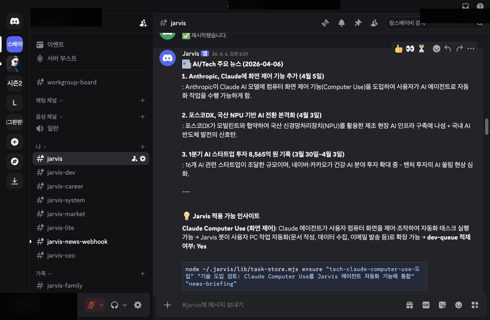

# Jarvis

<p align="center">
  <strong>AI operations platform that manages itself 24/7</strong><br>
  Discord Bot + RAG Knowledge Base + Self-Managing Automation
</p>

<p align="center">
  
  
  
  
</p>

<p align="center">
  
</p>
<p align="center"><em>Discord Bot: code review with inline fixes</em></p>

<p align="center">
  
</p>
<p align="center"><em>Automated: daily AI/Tech news briefing</em></p>

---

## What is Jarvis?

An **AI operations platform** — a Discord bot backed by Claude, a RAG knowledge base for long-term memory, and 110+ self-managing automation scripts. Everything runs locally on your machine.

```
                    ┌─────────────────┐
                    │   You interact   │
                    └────────┬────────┘
                ┌────────────┼────────────┐
                ▼                         ▼
          💬 Discord                🔧 Automation
        text chat 24/7             cron + agents
                │                         │
                └────────────┼────────────┘
                             ▼
               ┌────────────────────────┐
               │      Jarvis Core       │
               │                        │
               │  📚 RAG (LanceDB)      │
               │  🔌 MCP (integrations) │
               │  🤖 Multi-persona      │
               └────────────────────────┘
```

| | Feature | Description |
|---|---------|-------------|
| 💬 | **Discord Bot** | 24/7 text chat with streaming responses, per-channel personas, slash commands |
| 📚 | **RAG Knowledge Base** | Long-term memory. LanceDB + Ollama hybrid search across documents, decisions, notes |
| 🔧 | **Automation** | 110+ self-managing scripts. Health checks, watchdog, auto-restart, news briefing |
| 🔒 | **100% Local** | No cloud. No subscriptions. All data stays on your machine |
| 🔌 | **MCP Integration** | Connect to Home Assistant, GitHub, Slack, Notion via [MCP ecosystem](https://github.com/topics/mcp-server) |

## Quick Start

```bash
git clone https://github.com/Ramsbaby/jarvis.git && cd jarvis
```

### Step 1: RAG — Long-Term Memory

```bash
python scripts/setup_rag.py
```

Installs LanceDB, downloads Ollama embedding model, creates the vector database.

> **Requires**: [Ollama](https://ollama.com/download), Node.js 18+

### Step 2: Discord Bot + Automation

```bash
python scripts/setup_infra.py
```

Sets up the Discord bot, installs cron jobs, and configures monitoring.

> **Requires**: Node.js 18+, Discord bot token, Anthropic API key

## Discord Bot

A 24/7 text interface powered by Claude with streaming responses.

| Feature | Description |
|---------|-------------|
| **Streaming** | Real-time message updates as Claude thinks |
| **Personas** | Different personality per channel (`personas.json`) |
| **Slash commands** | `/search`, `/memory`, `/status`, `/alert` |
| **RAG integration** | Auto-injects relevant knowledge base context |
| **Family mode** | Separate data boundaries for family members |

## RAG Knowledge Base

Hybrid search: BM25 full-text + Ollama vector similarity (`snowflake-arctic-embed2`, 1024-dim).

```bash
cd rag
npm run query -- "your search query"    # Search
npm run stats                            # Check DB status
npm run compact                          # Reclaim space
```

| Spec | Value |
|------|-------|
| **Vector DB** | LanceDB (local, embedded) |
| **Embedding** | Ollama snowflake-arctic-embed2 |
| **Indexing** | Incremental, every 4 hours |
| **Search** | BM25 + vector hybrid (RRF k=60) |

See [`rag/README.md`](rag/README.md) for details.

## Automation

<p align="center">
  
</p>
<p align="center"><em>Automated system health check: 10 services monitored every 6 hours</em></p>

<p align="center">
  
</p>
<p align="center"><em>AI/Tech news analysis with actionable dev-queue suggestions</em></p>

110+ scripts for running Jarvis as a self-managing system:

| Category | Examples |
|----------|----------|
| **Monitoring** | System health, disk alerts, watchdog auto-restart |
| **RAG pipeline** | Incremental indexing, weekly compaction, quality checks |
| **Deployment** | Smoke tests, safe restart, log rotation |
| **Scheduling** | Cron templates, LaunchAgent templates (macOS) |

Cron template: `infra/templates/crontab.example`

## Project Structure

```
jarvis/
├── rag/                 # RAG module (LanceDB + Ollama)
├── infra/               # Infrastructure & automation
│   ├── discord/         # Discord bot + 30 handlers
│   ├── lib/             # Core libraries (MCP nexus, etc.)
│   ├── bin/             # Cron executables
│   ├── scripts/         # Automation scripts
│   ├── config/          # Configuration templates
│   ├── agents/          # AI agent profiles
│   └── templates/       # Cron & LaunchAgent templates
├── scripts/             # Setup wizards
└── docs/img/            # Screenshots
```

<details>
<summary><strong>MCP Integrations</strong></summary>

Connect to external tools via [MCP servers](https://github.com/topics/mcp-server). Configure in your `.env` or Discord bot config.

Popular: Home Assistant, Google Workspace, GitHub, Notion, Slack, Databases.

</details>

<details>
<summary><strong>Troubleshooting</strong></summary>

- **Discord bot won't start** — check `.env` has valid `DISCORD_TOKEN` and `ANTHROPIC_API_KEY`
- **RAG returns no results** — `cd rag && npm run stats` to check DB status
- **Cron jobs not running** — verify with `crontab -l`, check logs in `~/.local/share/jarvis/logs/`

</details>

## License

[MIT](LICENSE)

---

<p align="center">
  <a href="README.ko.md">🇰🇷 한국어</a>
</p>
